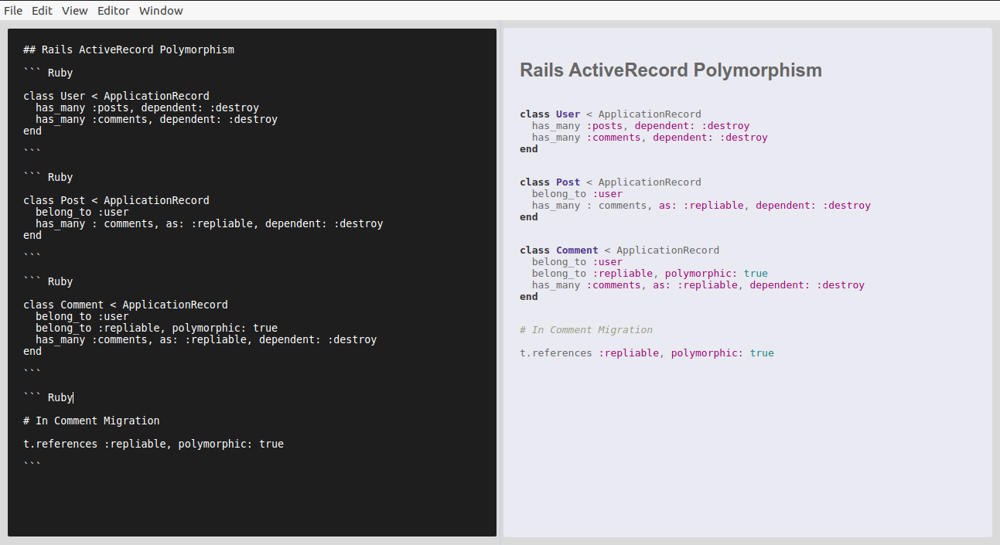

# Marked Field

A Markdown Editor with a split view for editing the markdown and previewing the HTML. Changes to markdown are automatically reflected in a preview window. For parsing markdown, Marked Field uses [Marked](https://github.com/markedjs/marked). It is a standalone application that uses Electron for the UI.



## Built With

- Electron
- JavaScript
- HTML
- CSS

## Instructions

``` bash

# Clone the repo from [github](https://github.com/chasscepts/markedfield.git)

$ git clone https://github.com/chasscepts/markedfield.git

$ cd markedfield

# install npm dependencies

$ npm install

# Build App

$ npm run make

# The package for your system is now available in out/make directory

```

## Requirements

The project uses [Electron Forge](https://github.com/electron-userland/electron-forge) for packaging. If you are running make for a debian distribution, it requires that you install the following packages - dpkg, fakeroot and rpm.

``` bash

# fakeroot

$ sudo apt install fakeroot

# rpm

$ sudo apt install rpm

```

## Authors

👤 **Obetta Francis**

[](https://github.com/chasscepts) [](https://twitter.com/chasscepts) [](https://www.linkedin.com/in/chasscepts/)

## 🤝 Contributing

Contributions, issues, and feature requests are welcome!

Feel free to check the [issues page](https://github.com/chasscepts/markedfield/issues).

## Show your support

Give a ⭐️ if you like this project!

## Acknowledgments

- This project provides a ui for [Marked](https://github.com/markedjs/marked)

## 📝 License

This project is [MIT](./LICENSE) licensed
