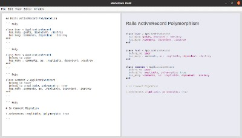

# Marked Field

> A Markdown Editor. It uses electron.js for graphical User Interface and [Marked](https://github.com/markedjs/marked) for parsing markdown.



## Built With

- Electron
- JavaScript
- HTML
- CSS

## Getting Started

To get a local copy up and running follow these simple example steps.

### Clone the project from it's github repo.

```

  $ git clone https://github.com/chasscepts/markedfield.git

```

### cd into the project directory

```
  $ cd markedfield

  # install npm dependencies
  $ npm install

```

## Authors

👤 **Obetta Francis**

[](https://github.com/chasscepts) [](https://twitter.com/chasscepts) [](https://www.linkedin.com/in/chasscepts/)

## 🤝 Contributing

Contributions, issues, and feature requests are welcome!

Feel free to check the [issues page](https://github.com/chasscepts/markedfield/issues).

## Show your support

Give a ⭐️ if you like this project!

## Acknowledgments

- This project provides a ui for [Marked](https://github.com/markedjs/marked)

## 📝 License

This project is [MIT](./LICENSE)
